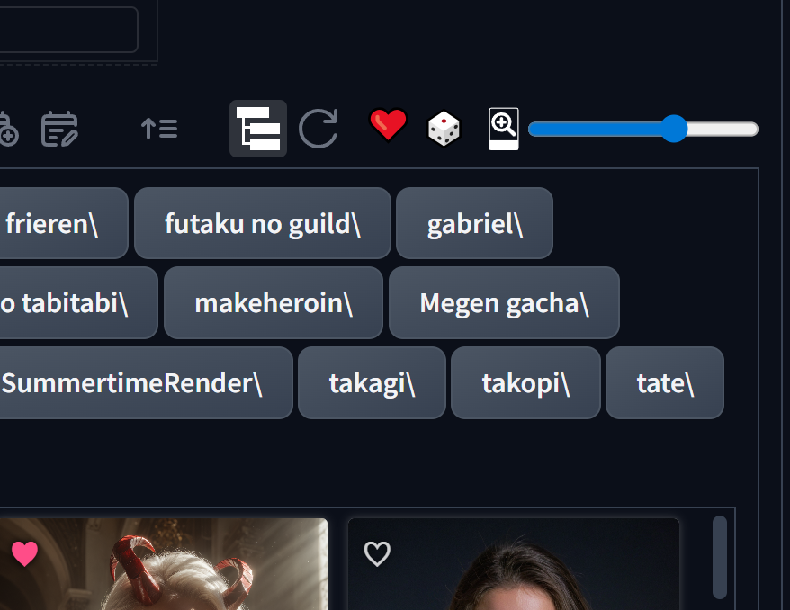

# Forge Random Card Sort 🎲

Small JavaScript-only extension for Stable Diffusion WebUI Forge that adds a
button to shuffle Extra Networks cards in the browser.



## Features

- Adds a Random button to Extra Networks controls
- Shuffles currently loaded Extra Networks cards without changing files on disk
- No Python dependencies and no startup installer

## Install

Clone or copy this folder into:

```text
webui/extensions/forge-random-card-sort
```

Then restart Forge.

## Notes

- Sorting is visual only and does not rename, move, or edit model files.
- The shuffled order is kept while navigating between UI pages and is restored
  after Forge reloads the Extra Networks list.
- Pressing Random again creates a new order. Using Forge's own sort controls
  clears the saved random order for that card list.
- The extension only modifies the Forge UI in the browser.
